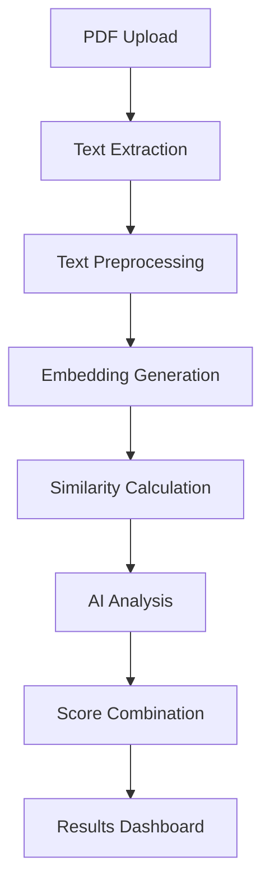

# 🤖 NEOHIRE AI

An advanced AI-powered resume screening and analysis tool that leverages multiple AI models including ChatGPT, Google Gemini, and Sentence Transformers to provide comprehensive ATS scoring and candidate matching.

## 🌟 Features

### Core Capabilities
- **Multi-Modal AI Analysis**: Integrates ChatGPT, Google Gemini, and Sentence Transformers
- **ATS Compatibility Scoring**: Industry-standard Applicant Tracking System scoring
- **Batch Processing**: Analyze multiple resumes simultaneously
- **PDF Text Extraction**: Robust extraction from various PDF formats
- **Semantic Matching**: Advanced similarity calculation beyond keyword matching
- **Interactive Dashboards**: Comprehensive visualizations and analytics
- **Export Results**: Download analysis results in CSV/Excel format

### AI-Powered Insights
- **Smart Keyword Analysis**: Identifies matched and missing keywords
- **Skill Gap Assessment**: Detailed breakdown of required vs. present skills
- **Experience Matching**: Quantified relevance scoring
- **Optimization Recommendations**: Actionable suggestions for resume improvement
- **Multi-Model Consensus**: Combined insights from multiple AI systems

## 📁 Project Structure

```
resume_analyzer/
│
├── app.py                      # Main Streamlit application
├── utils/
│   ├── __init__.py
│   ├── pdf_extractor.py        # PDF text extraction utilities
│   ├── text_processor.py       # Text preprocessing functions
│   └── matcher.py              # Similarity matching logic
├── models/
│   └── embeddings.py           # Embedding generation and management
├── data/
│   ├── sample_resumes/         # Sample PDF resumes for testing
│   └── sample_jds/             # Sample job descriptions
├── outputs/
│   └── results/                # Excel/CSV export files
├── requirements.txt            # Python dependencies
├── .env                        # Environment variables (API keys)
├── README.md                   # Project documentation
└── setup.py                    # Installation script
```

## 🚀 Quick Start

### 1. Installation

```bash
# Clone the repository
git clone https://github.com/pavithra-hn/NEOHIRE AI.git
cd NEOHIRE AI

# Create virtual environment
python -m venv venv
source venv/bin/activate  # On Windows: venv\Scripts\activate

# Install dependencies
pip install -r requirements.txt
```

### 2. API Configuration

Create a `.env` file in the project root:

```env
# OpenAI API Key
OPENAI_API_KEY=your_openai_api_key_here

# Google Gemini API Key
GOOGLE_API_KEY=your_google_gemini_api_key_here

# Optional: Model Configuration
OPENAI_MODEL=gpt-3.5-turbo
GEMINI_MODEL=gemini--2.5 pro
```

### 3. Run the Application

```bash
streamlit run app.py
```

The application will open in your browser at `http://localhost:8501`

## 🔧 Configuration

### API Keys Setup

#### OpenAI API Key
1. Visit [OpenAI Platform](https://platform.openai.com/api-keys)
2. Create a new API key
3. Add to `.env` file or enter in the app's sidebar

#### Google Gemini API Key
1. Visit [Google AI Studio](https://makersuite.google.com/app/apikey)
2. Create a new API key
3. Add to `.env` file or enter in the app's sidebar

### Model Configuration

The application supports multiple AI models:
- **Base Model**: `all-MiniLM-L6-v2` (Sentence Transformers)
- **ChatGPT**: `gpt-3.5-turbo` or `gpt-4`
- **Gemini**: `gemini-2.5 pro` or `gemini-pro-vision`

## 💡 Usage

### Single Resume Analysis
1. Upload a PDF resume
2. Paste the job description
3. Select AI models to use
4. Click "Run Enhanced Analysis"
5. View comprehensive results with ATS scoring

### Batch Analysis
1. Enter job description
2. Upload multiple PDF resumes
3. Configure AI analysis settings
4. Process all resumes simultaneously
5. Export results to CSV/Excel

### Key Metrics Explained

- **Base Similarity**: Semantic similarity using Sentence Transformers
- **ATS Score**: AI-calculated compatibility with ATS systems (0-100)
- **Match Percentage**: Overall candidate-job fit percentage
- **Skill Match**: Relevance of candidate skills (0-10)
- **Experience Match**: Alignment of experience with requirements (0-10)
- **Education Match**: Educational background fit (0-10)

## 📊 Analytics & Reporting

### Dashboard Features
- **Score Breakdown**: Radar charts comparing different metrics
- **Keyword Analysis**: Matched vs. missing keywords visualization
- **Model Comparison**: Side-by-side AI model results
- **Trend Analysis**: Batch processing insights

### Export Options
- CSV format for spreadsheet analysis
- Excel format with formatted results
- JSON format for API integration
- PDF reports (coming soon)

## 🔍 Technical Details

### AI Models Used

1. **Sentence Transformers (all-MiniLM-L6-v2)**
   - Local semantic similarity calculation
   - No API costs
   - Fast processing

2. **OpenAI GPT-3.5-turbo**
   - Advanced natural language understanding
   - ATS scoring and recommendations
   - Cost: ~$0.002 per 1K tokens

3. **Google Gemini Pro**
   - Multi-modal AI analysis
   - Enhanced insights and optimization tips
   - Cost: ~$0.0025 per 1K tokens

### Processing Pipeline



## 🛠️ Development

### Project Structure Details

#### `app.py`
Main Streamlit application with UI components and orchestration logic.

#### `utils/`
- `pdf_extractor.py`: PDF text extraction using pdfminer
- `text_processor.py`: Text cleaning and preprocessing
- `matcher.py`: Similarity calculation algorithms

#### `models/`
- `embeddings.py`: Sentence transformer model management

#### `data/`
- Sample resumes and job descriptions for testing
- Template files for different industries

#### `outputs/`
- Generated analysis results
- Export files in various formats

### Adding New Features

1. **New AI Model Integration**:
   ```python
   # Add to utils/ai_models.py
   def get_new_model_analysis(resume_text, jd_text):
       # Implementation
       return analysis_result
   ```

2. **Custom Scoring Algorithm**:
   ```python
   # Add to utils/scorer.py
   def calculate_custom_score(resume_data, jd_data):
       # Custom scoring logic
       return score
   ```

3. **New Export Format**:
   ```python
   # Add to utils/exporters.py
   def export_to_format(data, format_type):
       # Export implementation
       return file_path
   ```

## 📈 Performance & Scaling

### Optimization Tips
- Use batch processing for multiple resumes
- Enable caching for repeated analyses
- Implement rate limiting for API calls
- Use async processing for large datasets

### Cost Management
- Monitor API usage in the dashboard
- Set monthly spending limits
- Use base similarity for initial screening
- Apply AI models only to top candidates

## 🔒 Security & Privacy

### Data Handling
- No permanent storage of resume content
- API calls are made directly to AI providers
- Local processing for base similarity
- Secure environment variable management

### Best Practices
- Use environment variables for API keys
- Implement rate limiting
- Regular security updates
- Audit API usage

## 🐛 Troubleshooting

### Common Issues

1. **PDF Extraction Errors**
   ```bash
   # Install additional dependencies
   pip install pdfminer.six==20221105
   ```

2. **API Key Issues**
   ```bash
   # Check environment variables
   echo $OPENAI_API_KEY
   echo $GOOGLE_API_KEY
   ```

3. **Model Loading Errors**
   ```bash
   # Clear cache and reinstall
   pip uninstall sentence-transformers
   pip install sentence-transformers==2.2.2
   ```

### Performance Issues
- Reduce batch size for large datasets
- Check internet connection for API calls
- Monitor system memory usage
- Use GPU acceleration if available

## 🤝 Contributing

1. Fork the repository
2. Create a feature branch (`git checkout -b feature/amazing-feature`)
3. Commit changes (`git commit -m 'Add amazing feature'`)
4. Push to branch (`git push origin feature/amazing-feature`)
5. Open a Pull Request

### Development Guidelines
- Follow PEP 8 style guide
- Add unit tests for new features
- Update documentation
- Test with sample data

## 🙏 Acknowledgments

- **OpenAI** for GPT models
- **Google** for Gemini AI
- **Hugging Face** for Sentence Transformers
- **Streamlit** for the web framework
- **Community contributors** for feedback and improvements

## 📞 Support

- **Issues**: [GitHub Issues](https://github.com/pavithra-hn/NEOHIRE-AI/issues)
- **Email**: pavithrahn56@gmail.com

## 🔄 Changelog

### v2.0.0 (Latest)
- ✨ Added ChatGPT integration
- ✨ Added Google Gemini integration
- ✨ Implemented ATS scoring
- ✨ Enhanced batch processing
- ✨ Added comprehensive dashboards
- 🐛 Fixed PDF extraction issues
- 📚 Improved documentation

### v1.0.0
- 🎉 Initial release with basic similarity matching
- 📄 PDF text extraction
- 📊 Basic analytics
- 📤 CSV export functionality

## 🎯 Roadmap

- [ ] **GPT-4 Integration** - Advanced analysis capabilities
- [ ] **Resume Builder** - AI-powered resume optimization
- [ ] **Job Matching** - Candidate-job recommendation system
- [ ] **API Endpoints** - REST API for integration
- [ ] **Mobile App** - Mobile interface
- [ ] **Advanced Analytics** - ML-powered insights
- [ ] **Multi-language Support** - International resume support
- [ ] **Industry Templates** - Sector-specific analysis

---

Made with ❤️ by Pavithra H N(https://github.com/pavithra-hn)

⭐ **Star this repository if you find it helpful!**
